> **导语**｜你是否也遇到过这样的尴尬：业务库 PostgreSQL 跑事务很丝滑，可一旦做大表聚合、多维报表、留存漏斗分析，查询就慢到让人想砸键盘？这不是 PG 不行，而是**它压根不是为分析而生的**。本文从架构、引擎、数据模型到实战建表，逐层拆解 StarRocks 这款 MPP 分析型数据库为何能在 OLAP 场景把行式数据库甩开几十倍，并给出可直接复用的建表 SQL。全文约 6000 字，配 9 张图，读完你会对"分析为什么要换库"有一个体系化的认知。

**读完本文，你将收获：**

- 🏗️ 看懂 StarRocks 极简的 FE/BE 架构，以及一条 SQL 从提交到返回的完整旅程
- ⚡ 彻底理解"向量化执行"到底快在哪，而不只是知道这个名词
- ☁️ 搞清楚存算分离解决了什么痛点，以及它靠什么不掉性能
- 🧱 拿到 4 种数据模型的实战建表 SQL，照着改就能用
- 🆚 用一张表说清"为什么分析场景 SR 比 PostgreSQL 快"，以及该怎么选型

---

## 一、先认识它：StarRocks 是谁？

一句话：**StarRocks 是一款极速的分析型数据库（MPP，大规模并行处理），专为实时数据分析（OLAP）而生。**

它由 Apache Doris 的核心团队打造，后独立发展并捐赠给 Linux 基金会。如果说 MySQL/PostgreSQL 是"业务的账本"，那 StarRocks 就是"老板看的实时经营大屏"——前者管对错，后者管多快多全。

它身上有几个让人记得住的标签：

| 特性 | 一句话说人话 |
|------|------|
| ⚡ **极速查询** | 全面向量化 + CBO 优化器，复杂分析也能秒级出结果 |
| 🔄 **实时分析** | 数据秒级可见，支持实时更新（主键模型） |
| 🧩 **统一架构** | 一套系统搞定实时分析、Ad-hoc 查询、数据湖分析 |
| 🌊 **湖仓一体** | 不搬数据，直接查 Hive/Iceberg/Hudi/Delta Lake |
| 🔌 **MySQL 协议** | BI 工具、MySQL 客户端直接连，零学习成本 |
| ☁️ **存算分离** | 3.0+ 支持，计算节点想加就加、想缩就缩 |

---

## 二、架构极简到只有两个角色

很多分布式系统一上来就是七八个组件，光部署就劝退。StarRocks 反其道而行，**核心进程只有两类：FE 和 BE**，干净利落。

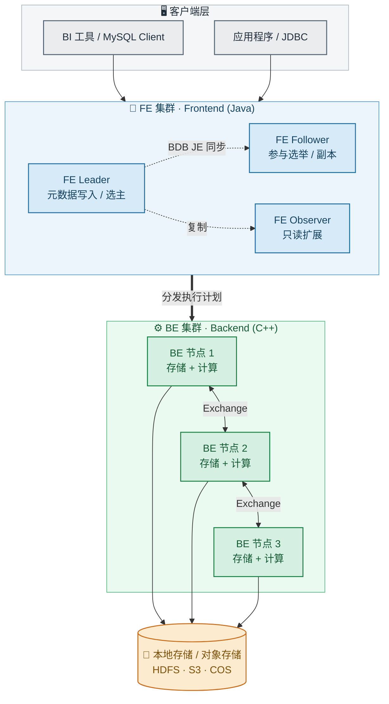

**FE（大脑）负责"动脑"：**
- **元数据管理**：表结构、分区、副本位置等
- **SQL 解析与优化**：词法/语法解析、生成执行计划、CBO 优化
- **集群管理与调度**：节点管理、负载均衡、副本管理
- 三种角色分工：**Leader**（写元数据）、**Follower**（高可用选举）、**Observer**（只读扩展查询能力）

**BE（手脚）负责"干活"：**
- **数据存储**：以列式格式存储数据
- **查询执行**：跑向量化执行算子
- 在**存算分离**架构里，BE 会"瘦身"成 **CN（Compute Node）**，只管算，数据丢到远端对象存储

> 💡 记忆点：**FE 想清楚怎么干，BE 埋头并行干**。组件少 = 运维心智负担小，这是 SR 相比 ClickHouse 等系统的一大体验优势。

---

## 三、一条 SQL 的奇幻漂流：查询是怎么跑起来的？

光看架构图还不够，我们跟着一条 `SELECT` 走完全程，你就明白"并行"二字是怎么落地的。

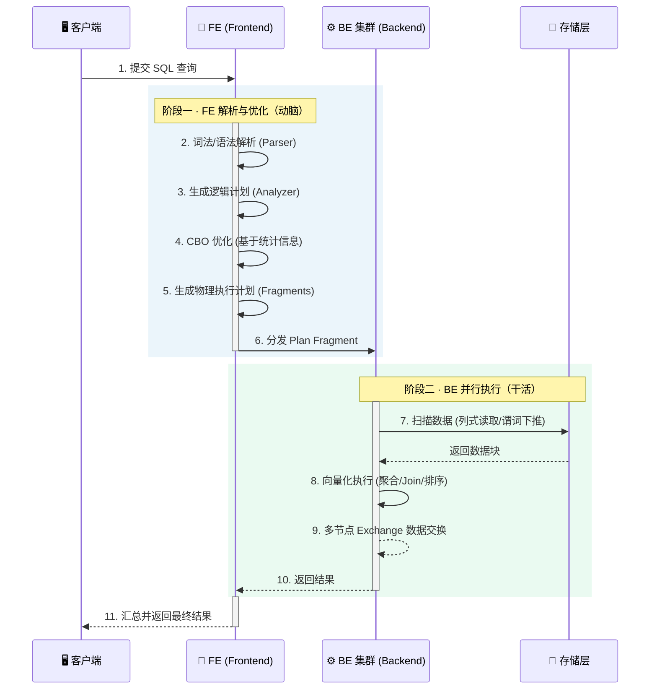

关键就在第 5、6 步：FE 把执行计划切成若干 **Fragment**，撒到多个 BE 上**同时**算；第 9 步各 BE 之间还会做数据交换（Exchange）。这就是 MPP 的精髓——**把一个大活拆成 N 份并行干**，而不是一个人闷头算到天黑。

---

## 四、四种数据模型：选对了，性能事半功倍

StarRocks 不是"一张表打天下"，而是按业务场景提供了四种模型。选型这一步如果踩错，后面再优化都事倍功半。

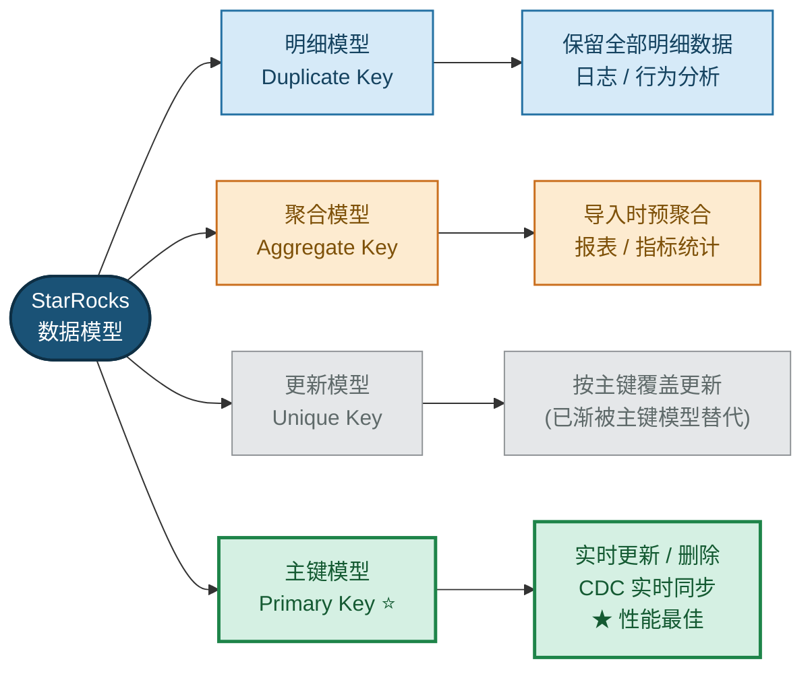

| 模型 | 什么时候用 | 一句话特点 |
|------|---------|------|
| **明细模型** | 日志、用户行为 | 来啥存啥，保留所有原始记录 |
| **聚合模型** | 固定维度报表 | 导入时就预聚合，省存储又快 |
| **更新模型** | 需要更新的数据 | 按 Key 覆盖（已逐渐被主键模型替代） |
| **主键模型** | 实时更新、CDC | 支持高频 Update/Delete，查询还快 |

> 🎯 选型口诀：**只追加看明细、固定报表用聚合、要实时更新选主键**。

---

## 五、数据是怎么进来的？导入流程一图看懂

分析的前提是数据先进得来。StarRocks 提供了多条导入通道，覆盖实时到离线的所有场景：

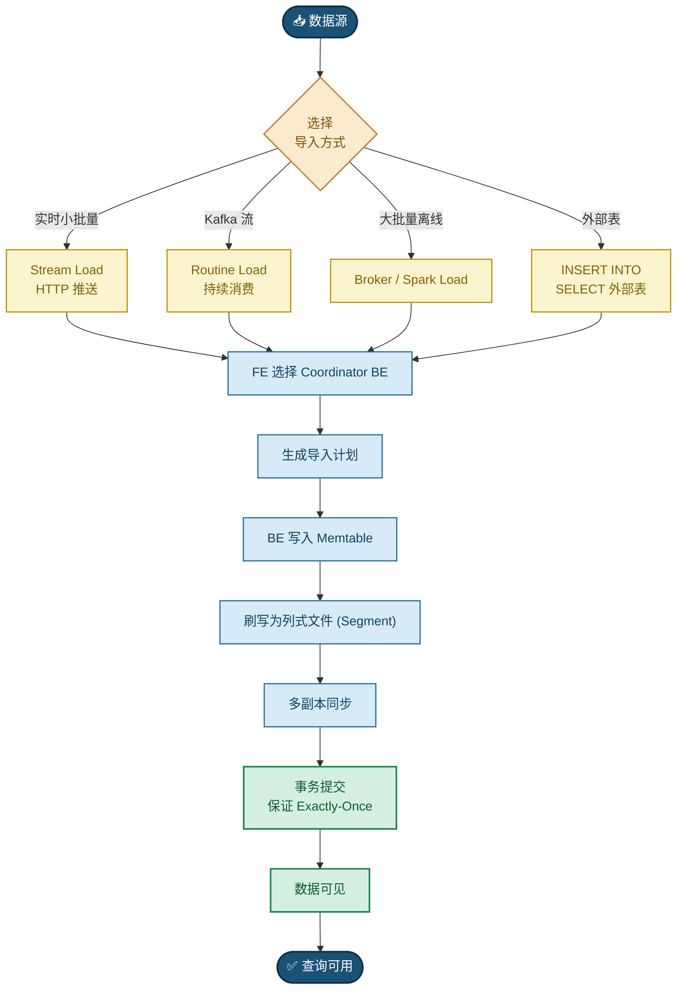

划重点：整个链路有**事务提交**保证 **Exactly-Once**，不会重复也不会丢，这对计费、报表这类对数据准确性敏感的场景至关重要。

---

## 六、它都用在哪？典型落地场景

1. 📊 **实时数据看板**：实时大屏、运营监控
2. 👣 **用户行为分析**：留存、漏斗、路径分析
3. 🔍 **自助 BI / Ad-hoc 查询**：替代 Presto/Impala
4. 🌊 **数据湖分析**：直接查 Iceberg/Hudi，无需数据搬迁
5. 🧰 **统一 OLAP 平台**：一套替代 ClickHouse + Druid + Presto 多套系统

顺带和同类产品快速对比一下：

| 维度 | StarRocks | ClickHouse | Apache Doris |
|------|-----------|------------|--------------|
| 多表 Join | 强（CBO 优化） | 较弱 | 较强 |
| 实时更新 | 主键模型，强 | 较弱 | 支持 |
| 并发能力 | 高 | 中 | 高 |
| 运维复杂度 | 低（仅 FE/BE） | 中 | 低 |
| 湖仓一体 | 强 | 弱 | 较强 |

---

## 七、进阶一：存算分离，把"加机器要搬数据"的痛根除

### 7.1 先说痛点：存算一体到底卡在哪？

传统的**存算一体**（Share-Nothing）架构里，每个 BE 既存数据又算数据，数据按副本（通常 3 副本）钉死在本地磁盘。爽是爽，但一到扩容你就头疼：

- 😣 **扩容必须搬数据**：加节点要重新均衡分片，又慢又影响线上查询
- 😣 **存算强耦合**：只想加算力，却被迫连存储一起买单
- 😣 **多副本贵**：3 副本 = 3 倍存储成本
- 😣 **资源不弹性**：白天查询多、夜里导入多，资源却固定，没法按需伸缩

### 7.2 解法：把存储和计算彻底拆开（3.0+）

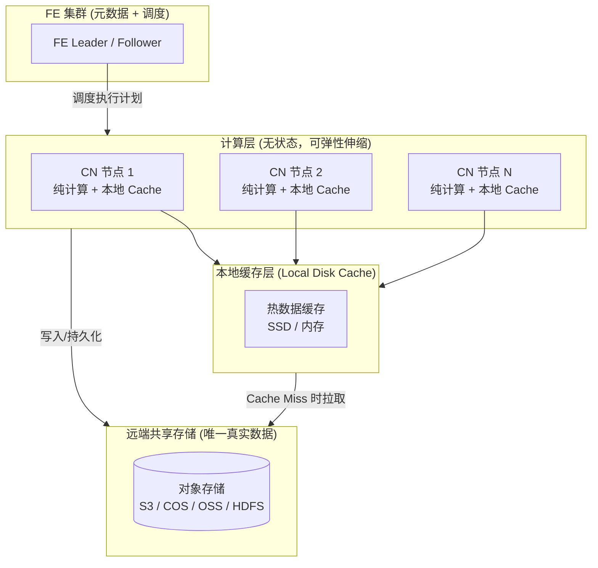

拆开后，世界清爽了：

| 维度 | 存算一体 | 存算分离 |
|------|---------|---------|
| 数据真身 | 本地磁盘多副本 | 对象存储单份（依赖对象存储自身冗余） |
| 节点角色 | BE（存储+计算） | CN（Compute Node，无状态计算） |
| 扩缩容 | 需搬迁数据，慢 | 秒级增减节点，无需搬数据 |
| 存储成本 | 3 副本 | 1 份（对象存储更便宜） |
| 数据可靠性 | 依赖本地副本 | 依赖对象存储（11 个 9） |

### 7.3 关键问题：数据都在远端，不会变慢吗？

会变慢——如果每次查询都老老实实去对象存储拉数据的话。StarRocks 用 **本地磁盘缓存（Local Disk Cache）** 化解了这个隐忧：

- 第一次访问从对象存储拉取，顺手缓存到本地 SSD/内存
- 后续查询命中本地缓存，性能**逼近存算一体**
- 缓存按 LRU 淘汰，热数据自然常驻本地

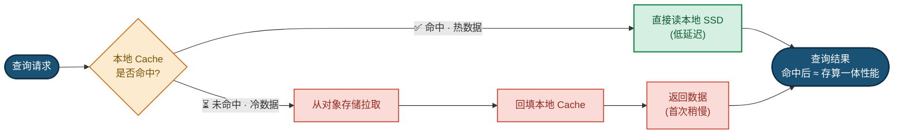

**这套架构特别适合：** 数据量大且冷热分明、需要弹性伸缩（如大促临时扩容）、多套集群共享同一份数据做读写/查询隔离。

---

## 八、进阶二：向量化引擎，SR 快的"发动机"

存算分离解决的是"成本与弹性"，而真正让查询飞起来的，是**向量化执行引擎**。这块儿是 SR 性能的命门，我们掰开揉碎讲。

### 8.1 老办法的天花板：火山模型逐行处理

传统数据库（含早期 PostgreSQL）用的是**火山模型**，数据一行一行地过：

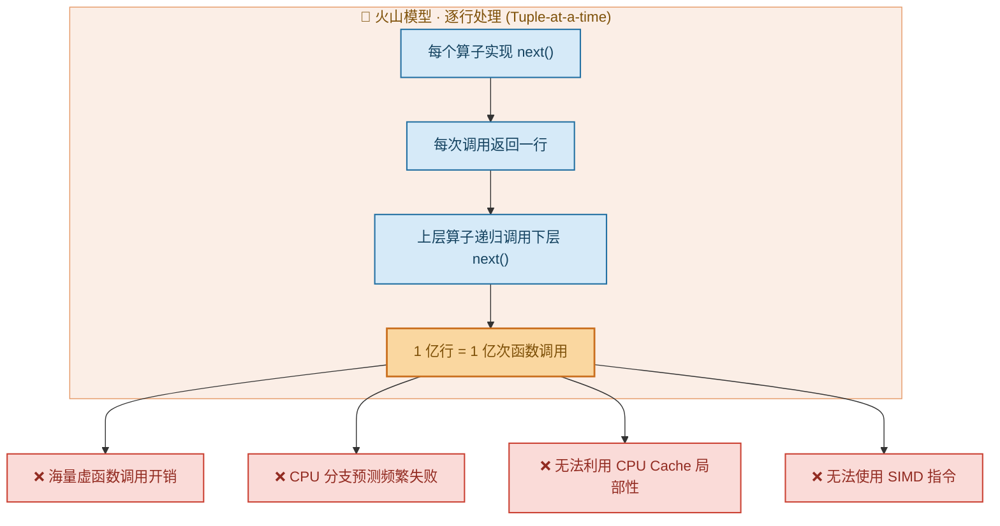

逐行处理，代价有多大？

- **虚函数调用爆炸**：每行每个算子一次虚函数调用，1 亿行就是上亿次
- **CPU Cache 命中率低**：数据散落，频繁 cache miss
- **SIMD 用不上**：现代 CPU 一条指令能算多个数据的能力，完全浪费

### 8.2 新办法：向量化，一次处理一"批"

StarRocks 把"逐行"改成"**逐批（一列一批）**"，一次处理一个数据块（Chunk，默认 4096 行）：

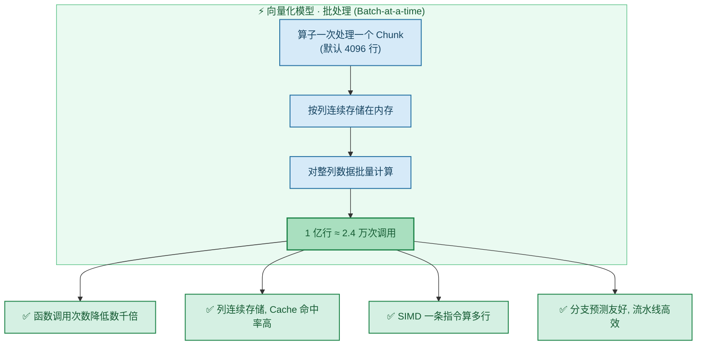

同样是 1 亿行，函数调用从"上亿次"骤降到"约 2.4 万次"，量级差异肉眼可见。具体靠三招：

**① 列式内存布局，喂饱 CPU Cache**
数据在内存里按列连续存放（如 `[age1, age2, age3, ...]`）。算 `age > 30` 时 CPU 顺序扫一整列，Cache 命中率拉满。

**② SIMD 指令，一条顶十几条**
现代 CPU 的 SIMD（AVX2/AVX-512）一条指令能同时处理 8/16 个数据。比如给一列做 `+1`：

```
普通：逐个 +1，执行 4096 次
SIMD：一条指令处理 16 个，仅执行 256 次
```

**③ 算子全面向量化 + 一堆黑科技**
扫描、过滤、聚合、Join、排序全部按 Chunk 批量执行，并叠加：
- **延迟物化（Late Materialization）**：先过滤，再去读真正需要的列
- **谓词下推 + 字典编码**：低基数列（性别、状态）用字典 int 比较替代字符串比较
- **运行时过滤（Runtime Filter）**：Join 时用小表的值动态过滤大表扫描

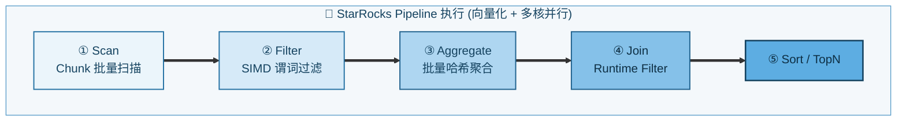

### 8.3 把 SIMD 讲透：一条指令，同时算一排数据

上面反复提到 SIMD，它到底是什么、凭什么能加速？这一节单独掰开讲清楚，因为它是"列存 + 向量化"能压榨 CPU 的物理基础。

**SIMD 是什么？**
SIMD = **Single Instruction, Multiple Data（单指令多数据）**。普通 CPU 指令是 SISD——一条指令处理一个数据；而 SIMD 指令配合超宽寄存器，一条指令就能对一排数据同时做相同运算。

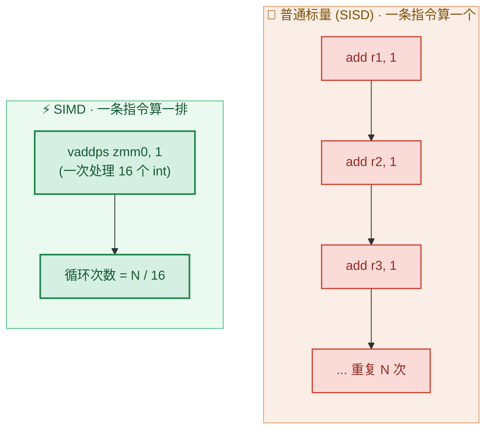

**寄存器有多宽，一次就能算多少个？**
SIMD 的并行度取决于寄存器位宽与数据类型位宽，公式就是"寄存器位宽 ÷ 单个数据位宽"：

| 指令集 | 寄存器位宽 | 一次处理 int32 | 一次处理 int64 |
|--------|-----------|:----:|:----:|
| SSE | 128 bit | 4 个 | 2 个 |
| AVX2 | 256 bit | 8 个 | 4 个 |
| AVX-512 | 512 bit | 16 个 | 8 个 |

> 💡 这就是 8.2 里"4096 行做 +1，SIMD 只需 256 次（4096 / 16）"的由来——用的正是 AVX-512 一次算 16 个 int32。

**为什么 SIMD 必须配"列存 + 向量化"才能用上？**
SIMD 有个硬前提：参与运算的数据要**类型相同、在内存里连续排列**，这样才能一次性灌进宽寄存器。

- **行存**：一行里 `id|name|age|amount` 各种类型挤在一起，`age` 之间被其它字段隔开，根本凑不齐一排同类型数据 → SIMD 用不上
- **列存 + 向量化**：同一列（如全是 `int` 的 `age`）天然连续存放 `[age1, age2, age3, ...]`，正好一口气塞进 SIMD 寄存器 → 完美契合

所以"**列式存储是地基，向量化是搬运工，SIMD 是真正干活的引擎**"，三者缺一不可。

**StarRocks 在哪些地方吃到了 SIMD 红利？**
不止做加减法，几乎所有重计算算子都被 SIMD 加速：

- **过滤（Filter）**：`age > 30` 一次比较一整排，生成 0/1 选择掩码（selection mask）
- **聚合（SUM/COUNT/MIN/MAX）**：对整列做横向归约（reduction）
- **类型转换 / 算术表达式**：`amount * 1.1`、`cast` 等批量执行
- **哈希计算、字典编码比较**：低基数列用 int 批量比较替代字符串逐字符比较

> 🔧 工程上 SR 会在运行时探测 CPU 支持的指令集（SSE/AVX2/AVX-512）自动选择最优实现；现代 C++ 编译器在列式连续内存 + 简单循环下也会**自动向量化（auto-vectorization）**，二者结合把 CPU 的吞吐拉满。

### 8.4 再加一层：Pipeline 并行压榨多核

SR 3.x 还引入了 **Pipeline 执行引擎**，把执行计划拆成 Pipeline，按 CPU 核数自适应并行，彻底压榨多核，告别"一个 Fragment 一个线程"的资源浪费。**向量化负责单核跑得快，Pipeline 负责多核一起跑**，两者叠 buff。

---

## 九、实战：4 种模型的建表 SQL，照着改就能用

理论讲完，上硬货。以下 SQL 均可直接套用，注释里标了关键语法。

### 9.1 明细模型（Duplicate Key）— 日志 / 行为数据

```sql
CREATE TABLE user_event_log (
    event_time   DATETIME       NOT NULL  COMMENT '事件时间',
    user_id      BIGINT         NOT NULL  COMMENT '用户ID',
    event_type   VARCHAR(32)    NOT NULL  COMMENT '事件类型',
    page_url     VARCHAR(512)             COMMENT '页面URL',
    device       VARCHAR(32)              COMMENT '设备类型'
)
DUPLICATE KEY (event_time, user_id)       -- 仅作排序键，不去重
PARTITION BY RANGE (event_time) (          -- 按天分区，便于裁剪/淘汰
    START ("2026-01-01") END ("2026-12-31") EVERY (INTERVAL 1 DAY)
)
DISTRIBUTED BY HASH (user_id) BUCKETS 32    -- 按 user_id 分桶，打散到各 BE
PROPERTIES (
    "replication_num" = "3"
);
```

### 9.2 聚合模型（Aggregate Key）— 预聚合报表

```sql
CREATE TABLE sales_daily_agg (
    dt           DATE           NOT NULL  COMMENT '日期',
    region       VARCHAR(32)    NOT NULL  COMMENT '地区',
    product_id   BIGINT         NOT NULL  COMMENT '商品ID',
    total_amount DECIMAL(18,2)  SUM       COMMENT '销售额(求和)',
    order_cnt    BIGINT         SUM       COMMENT '订单数(求和)',
    max_price    DECIMAL(18,2)  MAX       COMMENT '最高单价'
)
AGGREGATE KEY (dt, region, product_id)     -- 维度列做 Key，导入时自动按指标聚合
PARTITION BY RANGE (dt) (
    START ("2026-01-01") END ("2026-12-31") EVERY (INTERVAL 1 MONTH)
)
DISTRIBUTED BY HASH (product_id) BUCKETS 16;
```
> 💡 导入时相同 Key 的行会自动按 SUM/MAX 聚合，既省存储又加速报表查询。

### 9.3 主键模型（Primary Key）— 实时更新 / CDC

```sql
CREATE TABLE user_profile (
    user_id      BIGINT         NOT NULL  COMMENT '用户ID(主键)',
    user_name    VARCHAR(64)              COMMENT '用户名',
    level        INT                      COMMENT '等级',
    balance      DECIMAL(18,2)            COMMENT '余额',
    update_time  DATETIME                 COMMENT '更新时间'
)
PRIMARY KEY (user_id)                       -- 主键，支持实时 UPDATE/DELETE
DISTRIBUTED BY HASH (user_id) BUCKETS 16
PROPERTIES (
    "replication_num" = "3",
    "enable_persistent_index" = "true"      -- 持久化主键索引，省内存
);

-- 主键模型支持直接 UPSERT（同主键覆盖）
INSERT INTO user_profile VALUES
    (1001, '张三', 5, 200.00, '2026-06-22 17:00:00');
```
> 💡 主键模型是 CDC 实时同步（Flink CDC、Canal）的首选，支持高频更新且查询性能高。

### 9.4 存算分离表

```sql
-- 需先创建存储卷指向对象存储
CREATE STORAGE VOLUME my_s3_volume
TYPE = S3
LOCATIONS = ("s3://my-bucket/starrocks/")
PROPERTIES (
    "aws.s3.endpoint" = "cos.ap-guangzhou.myqcloud.com",
    "aws.s3.access_key" = "xxx",
    "aws.s3.secret_key" = "yyy"
);

CREATE TABLE orders_shared (
    order_id    BIGINT      NOT NULL,
    user_id     BIGINT      NOT NULL,
    amount      DECIMAL(18,2),
    create_time DATETIME
)
PRIMARY KEY (order_id)
DISTRIBUTED BY HASH (order_id) BUCKETS 16
PROPERTIES (
    "storage_volume" = "my_s3_volume",       -- 数据存到对象存储
    "datacache.enable" = "true",             -- 开启本地缓存加速
    "datacache.partition_duration" = "7 DAY" -- 最近7天数据本地缓存
);
```

**建表关键概念速记：**

| 关键字 | 作用 |
|--------|------|
| `DUPLICATE/AGGREGATE/PRIMARY/UNIQUE KEY` | 选择数据模型 |
| `PARTITION BY` | 分区，用于查询裁剪和数据生命周期管理 |
| `DISTRIBUTED BY HASH ... BUCKETS` | 分桶，决定数据如何打散到节点并行 |
| `replication_num` | 副本数（存算一体） |
| `storage_volume` | 指向对象存储（存算分离） |

---

## 十、灵魂拷问：同样查数据，凭啥 SR 比 PostgreSQL 快这么多？

这是本文最核心的问题。先摆明立场：**PostgreSQL 没毛病，它是顶级的 OLTP 事务型行式数据库；SR 是 OLAP 分析型列式 MPP 数据库。两者赛道不同。** 但在"大数据量聚合分析"这条赛道上，SR 确实快得多。原因有五：

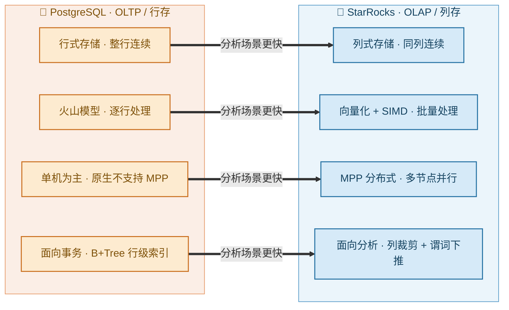

### ① 列存 vs 行存：只读你要的列
分析查询常常是 `SELECT SUM(amount) FROM orders`，只用 1 列。
- **PostgreSQL（行存）**：整行连续存储，读 1 列也得把整行捞进来，I/O 全浪费在没用的字段上
- **StarRocks（列存）**：同列连续存储，要哪列读哪列，I/O 大幅减少，且同类型数据压缩率极高

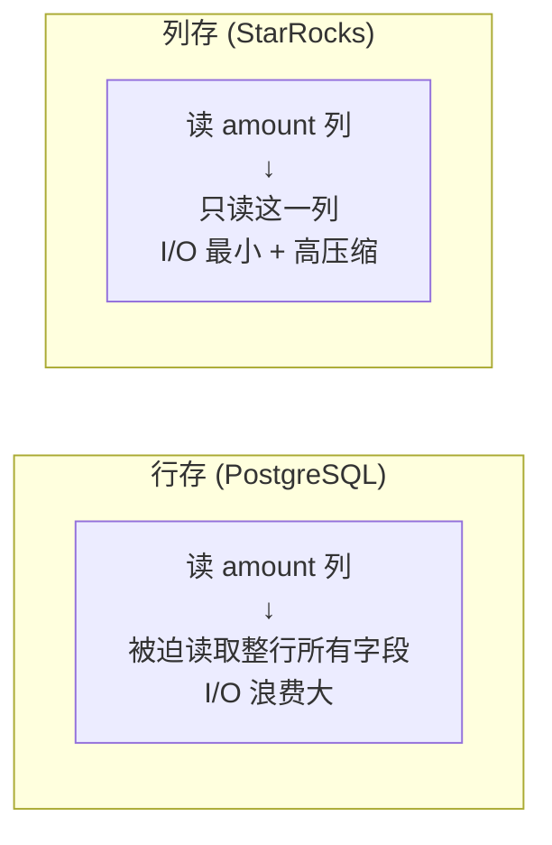

### ② 向量化 vs 火山模型：批量打 vs 单点戳
- **PostgreSQL**：经典火山模型，逐行 `next()`，海量虚函数调用，SIMD 用不上（注：PG 也在引入 JIT 与部分向量化，但非核心引擎）
- **StarRocks**：全面向量化，按 Chunk（4096 行）批处理 + SIMD，函数调用次数降低数千倍

### ③ MPP 并行 vs 单机：人多力量大
- **PostgreSQL**：原生单机执行，单条查询难以利用多机算力（要靠 Citus 等插件才能分布式）
- **StarRocks**：原生 MPP，一条查询自动拆成多个 Fragment，跨多节点 + 多核并行，大表扫描/Join 近似线性加速

### ④ 压缩与编码：扫得少自然快
- 列存同列数据类型一致、相似度高，SR 用字典编码、RLE、Bitshuffle 等，压缩比远高于行存。**扫描的数据更少 = 更快**

### ⑤ 一身的分析专属优化
- StarRocks：CBO 优化器、物化视图、Runtime Filter、分区分桶裁剪、低基数全局字典……全是为 OLAP 量身打造
- PostgreSQL：B+Tree 索引面向点查/事务，对全表聚合扫描帮助有限

### 一表看尽差异

| 维度 | PostgreSQL | StarRocks | 分析场景谁快 |
|------|-----------|-----------|:----:|
| 定位 | OLTP 事务 | OLAP 分析 | — |
| 存储方式 | 行式存储 | 列式存储 | SR |
| 执行引擎 | 火山模型（逐行） | 向量化 + SIMD（批量） | SR |
| 架构 | 单机为主 | MPP 分布式并行 | SR |
| 压缩率 | 较低 | 高（列式编码） | SR |
| 大表聚合/Join | 慢 | 快（常数十倍） | SR |
| 单行点查/事务 | 快、强一致 | 不擅长 | PG |
| 高并发写更新 | 强（ACID） | 一般 | PG |

---

## 十一、写在最后：TL;DR + 选型建议

**一句话总结 SR 为何更快：**

> 列式存储减少 I/O ➕ 向量化/SIMD 压榨 CPU ➕ MPP 多机并行 ➕ 高压缩比扫得少。
> 四者叠加，针对 OLAP 做了全链路优化；而 PostgreSQL 的"行存 + 火山模型"是为事务点查设计的，跑大规模分析天然吃亏。

**怎么选，别纠结：**

- 🟢 **事务、强一致、点查写入** → 用 **PostgreSQL**
- 🔵 **海量数据实时分析、报表、BI** → 用 **StarRocks**
- 🤝 **最佳实践是组合拳**：PG 做业务库 → CDC 同步 → SR 做分析。各司其职，全都要。

---

> 如果这篇对你有帮助，欢迎点赞收藏，也欢迎在评论区聊聊你踩过的"分析慢"的坑～
